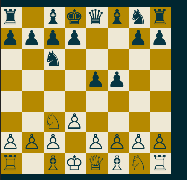

# what is this


You have a chess repertoire pgn file and want to know where it could be improved.
We should find possition where there are likely and unaccounted opponent moves.
Unaccounted moves are easy to spot in the database. Determining the likelyhood is harder. 
One could count the occurance of possitions in the database and compare to the total number of games
but that neglects that on our turn, we choose few moves and reduce the space accordingly.


This scripts uses the lichess database to calculate likelyhood of possitions and 
look at the opponent move distributions in that possition to make suggestions
on where to enhance a repertoire.


# usage
```
pip install bunseki


# whites perspective, missing moves musst have been played at least 500 times
# utility is the probability of seeing the top opponent move
# we sort by that, cutoff is defined by -q
bunseki -w 1  -i lichessstudy_white.pgn -m 500 -q .5

# to check against lichess user database instead of the masters, e.g.:
-d 1  -s 1600 1800 -t blitz rapid
```

# example

```
$bunseki -w 1 -i lichessstudy_white.pgn -m 500 -q 2 -d 1

possition frequency:35.68 utility:6.15 <- possition proability and utility of learning a new move
♖ ♘ ♗ ♕ ♔ ♗ ♘ ♖            <- colors conveniently inverted for terminal usage
♙ ♙ ♙ ♙   ♙ ♙ ♙

        ♙
        ♟
          ♞
♟ ♟ ♟ ♟   ♟ ♟ ♟
♜ ♞ ♝ ♛ ♚ ♝   ♜
        Nc6     6235325(66)     OK [50, 4, 44]
        d6      1619060(17)     !! [52, 4, 42] <- this move is missing in the db
        Nf6     869610(9)       OK [49, 4, 45]

1. e4 e5 2. Nf3 *
rnbqkbnr/pppp1ppp/8/4p3/4P3/5N2/PPPP1PPP/RNBQKB1R b KQkq - 1 2
https://lichess.org/analysis/rnbqkbnr/pppp1ppp/8/4p3/4P3/5N2/PPPP1PPP/RNBQKB1R_b_KQkq_-_1_2


$bunseki_repobuilder -i black_auto.pgn -w 0 -u 2 -d 1 -c 0 
1. e4 ( 1. d4 Nf6 2. Nf3 ( 2. c4 e6 3. Nc3 ( 3. Nf3 Bb4+ ) ( 3. g3 Bb4+ ) 3...
   Bb4 ) ( 2. Bf4 g6 ) 2... e6 3. c4 Bb4+ ) ( 1. c4 Nf6 2. Nc3 g6 ) ( 1. Nf3
   Nf6 ) 1... c5 2. Nf3 ( 2. Bc4 e6 ) ( 2. Nc3 Nc6 ) ( 2. d4 cxd4 3. c3 dxc3 4.
   Nxc3 Nc6 ) ( 2. f4 d5 ) ( 2. c3 Nf6 3. e5 Nd5 ) 2... Nc6 3. Bb5 ( 3. d4 cxd4
   4. Nxd4 Nf6 5. Nc3 ( 5. Nxc6 bxc6 ) 5... e5 6. Ndb5 ( 6. Nb3 Bb4 ) ( 6. Nxc6
   bxc6 ) 6... d6 7. Bg5 a6 8. Na3 b5 9. Nd5 Be7 ) ( 3. Bc4 e6 ) ( 3. c3 Nf6 )
   ( 3. Nc3 g6 ) 3... g6 4. O-O Bg7 5. Re1 e5 *

# -u 2 adds all moves that appear with frequency .02 to the moves in an existing pgn
# automatically choosing moves for our side
# there is also an argument to start from a certain ply count to obtain a file for
# one specific opening

```


# strange stuff

* i would have liked to use UCI notation to communicate between python-chess and lichess
but they use different notation for castles.


# terminal printing 

see makequiz on how to print theese:


